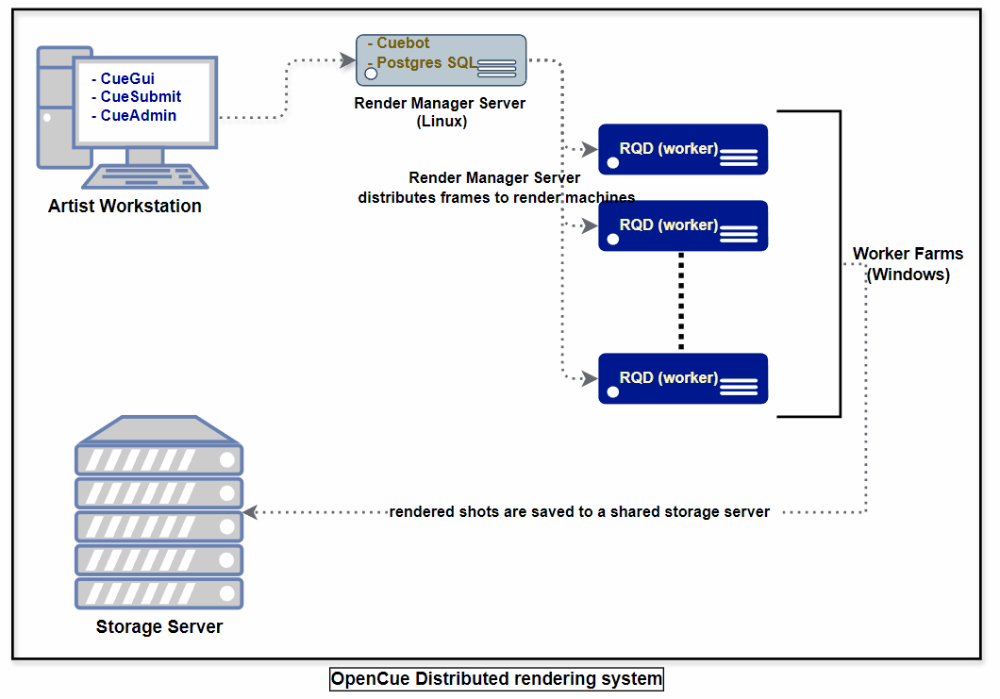
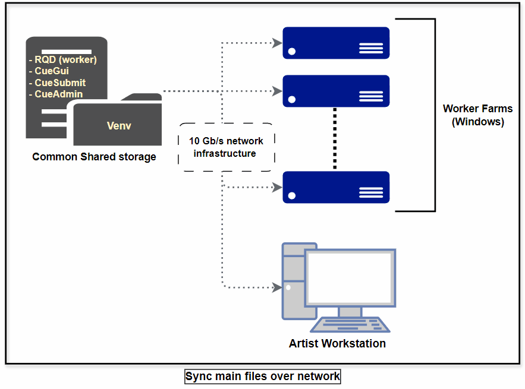
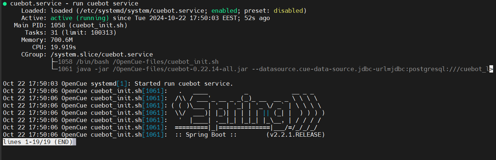
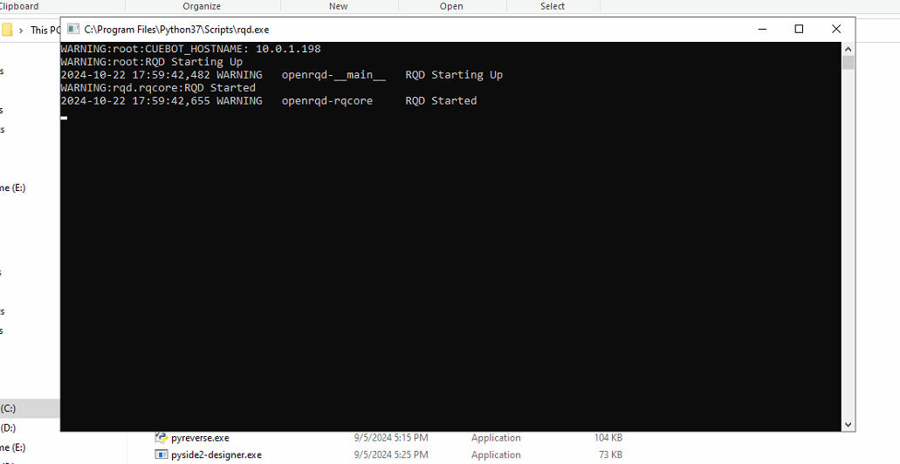
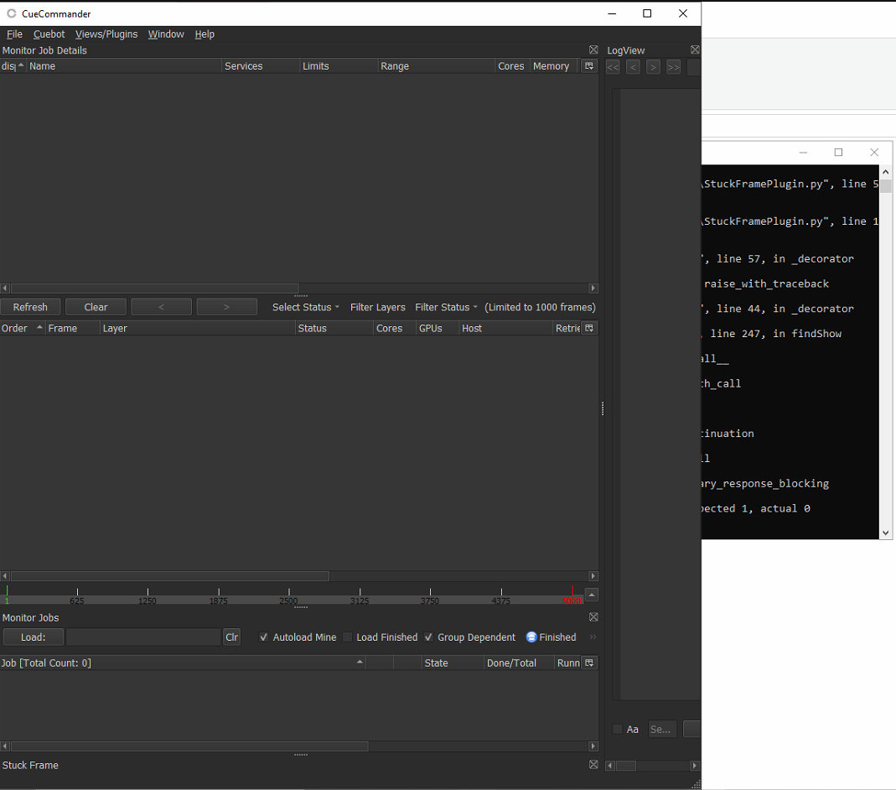
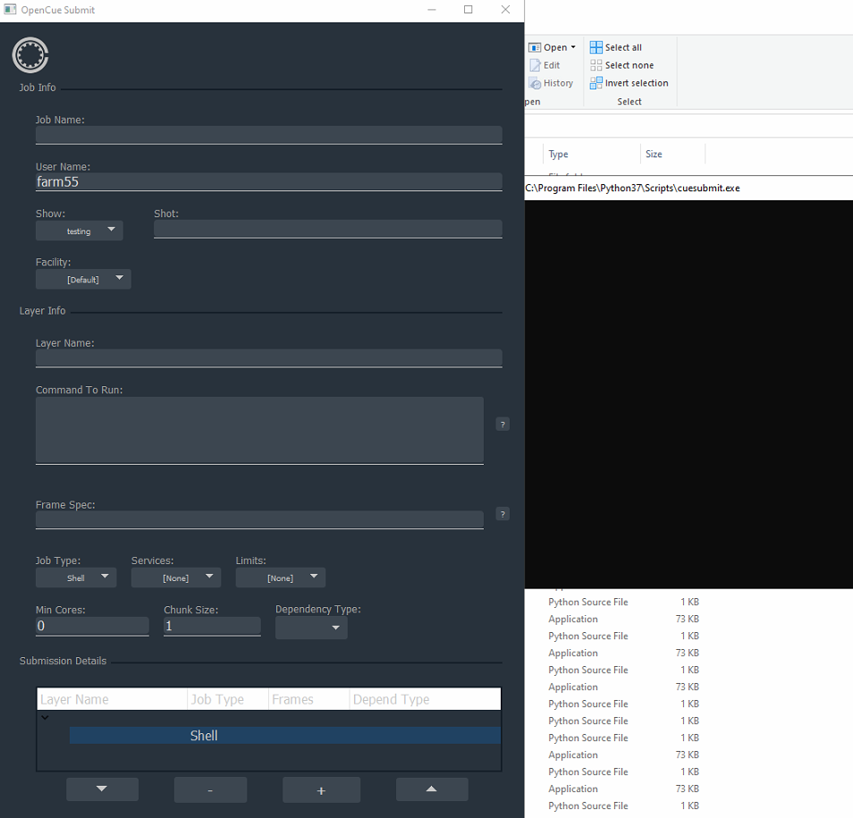

# OpenCue Render Manager System Deployment






This repository provides a deployment system for the **OpenCue Render Manager** across various platforms, including Linux, macOS, and Windows. Since OpenCue is a Python-based system, this deployment is designed to function seamlessly in a Windows environment as well, utilizing a virtual environment setup and a shared server.

the original repo : https://github.com/AcademySoftwareFoundation/OpenCue/releases

the original documentation : https://www.opencue.io/docs/getting-started/


## Features
- **Cross-Platform Support:** Supports Linux, macOS, and Windows platforms.
- **Centralized Deployment:** A shared storage (server) serves as the central point for all deployment configurations and virtual environment management.
- **Worker Synchronization:** Automatically synchronizes workers with the shared server for consistent setups across all devices.
- **Batch Script for Windows:** Simplifies deployment on Windows machines with a single click, including support for multiple Python versions.
- **Linux Service:** The cuebot server is deployed on a Linux machine, managed via a Bash script and service setup.

## Components
1. **Linux Server (cuebot):**
   - The server is set up on a dedicated Linux machine.
   - Bash script (`cuebot_init.sh`) initializes the cuebot service.
   - Configured as a systemd service for automatic startup and management.
   
2. **Windows Workers:**
   - Virtual environments (`venv`) are hosted on a shared storage.
   - Batch script (`install.bat`) for installing and setting up the render manager system on individual machines, with easy Python version switching.

3. **Shared Storage Sync:** All Windows and macOS devices synchronize their configurations with the central shared storage.

## Usage

### Linux (cuebot server)
1. Install necessary dependencies from original documentation:
   make suer to set database user and password in cuebot_init.sh file and edit opencue.service path
   ```bash
   https://www.opencue.io/docs/getting-started/
   sudo systemctl start opencue.service
   sudo systemctl enable opencue.service


   
### Windows (workers)
1. pull the original repo:
2. create Venv (I recommend using python 3.7):
3. run install.bat as admin:




### Windows (Artists)

#### CueGUI


#### CueSubmit



##Scripts Overview
cuebot_init.sh: A Bash script to initialize the cuebot service on a Linux server. It sets the environment variables and starts the cuebot using the provided .jar file and 
PostgreSQL credentials.

install.bat: A Batch script that installs the virtual environment and dependencies on a Windows machine, allowing workers to sync with the shared storage.


